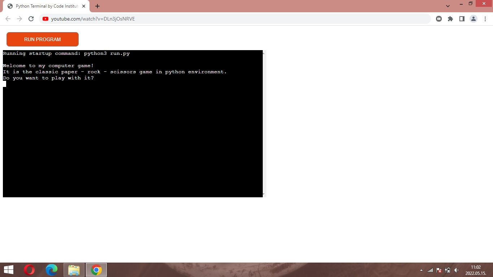
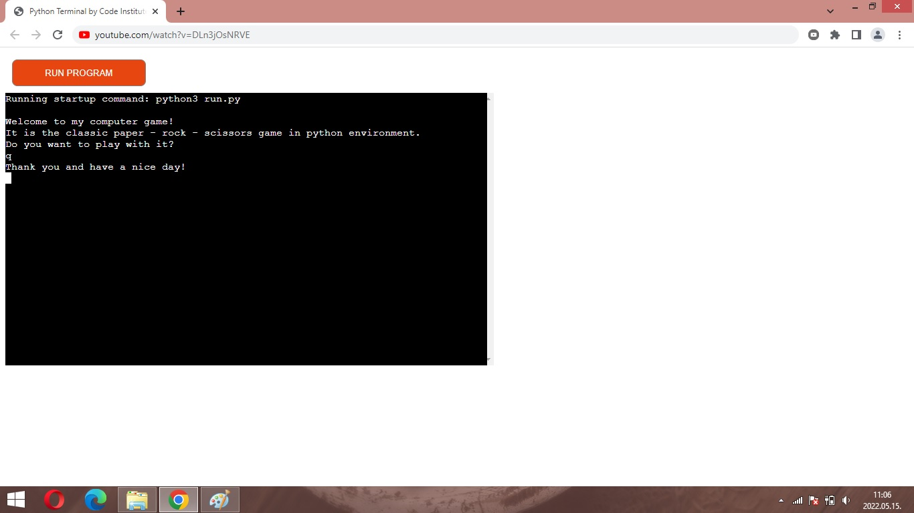
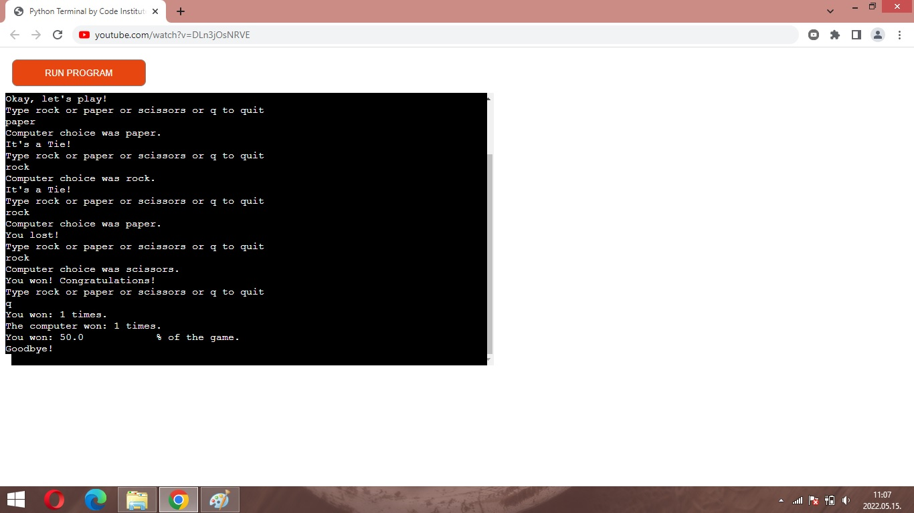

# Rock - Paper - Scissors: The classic game is back

Rock, Paper, Scissors is a classic game which runs on Heroku. The excitement of the game is given by its variety, even if there are three options to choose from. You can find more information about this game on the [Wikipedia](https://en.wikipedia.org/wiki/Rock_paper_scissors).

You could find the live version of my project [here](https://third-milestone-project-prs.herokuapp.com/)

You can see the responsivity of the app below:

## How to play?
The player choose from three options and the computer also.
According to the rules of the game rock hit scissors, scissors hit paper and paper hit rock.
If the player and the computer chose the same option it will be 'Tie'.
The goal of the player is to score more points than the computer.

## Features
### Existing features
- Accepts user input;

- Give the oportunity to quick from the game before start it;

- Play against the computer;
- Random options generation for computer;
- Input validation and exception checking:
    - Have to write the option with lowercase;
    - You can choose from the three options which contain the full words of rock, paper or scissors;
    - Zero divide exception is maintain;
- Maintain scores.

### Future feature
- Count the options how many times You chose during the play;

## Data Model

### Testing

### Bugs and validation
#### Solved bug
During the development of my project, I was getting zero divide error because when I maintained the scores by percentage I did not used exception. I fixed this with if/elif/else exception method using.

#### Validation with PEP8
Tested in my local terminal and the Code Institute Heroku Terminal.
Given invalid inputs: numbers and/or abbreviations when strings were expected.  
I validated my app with PEP8 validator and everything was all right according to the validator. 

## Deployment
- Create a new Heroku app;
- Set the 'python' and 'node.js' buildpacks, in this order;
- Link the Heroku app to my repository of my third project;
- Click on 'Deploy' button and I got "Internal server error" message. My Heroku token was compromised. Unfortunately, I did not find a proper solution on the internet and Slack. Furthermore, my mentor also could not solve the problem so I used the tutor support. I would like to tell thank to Franciska who solve this problem via gitpod. After this small victory I tried to open the app and I got "Application error" message. After two days SAR (Search and Rescue) mission I used again tutor support of Code Institute. Thank to Christine, who found the problem in package.json, I could open the app and finalised my project. 

## Credits
- Code Institute for the deployment terminal;
- Wikipedia for the details of the game.